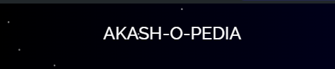

<div align="center">



<a href="https://akashdey23.github.io/react_pf/">[GOO LIVE]</a>   

### Personal Portfolio

<div align="center">
      
      
      
      
      <br>
 </div>

---

</div>

<h1 align="center">About My Portfolio</h1>

## Summary

I have developed a fully responsive portfolio website.
The website is built using React and is fully responsive.
It has a clean and minimalistic design.
The website is fully functional and has all the necessary features.
The website is also fully accessible and follows all the accessibility guidelines.
The website is also fully SEO optimized and has a good page speed score.
The website is also fully secure and has all the necessary security features.


# Docs

- Table of Contents

  - [Codebase](#codebase)

    - [Technologies](#technologies)
    - [Folder Structure](#folder-structure)

  - [Project Setup](#project-setup)

    - [First time setup](#first-time-setup)
    - [Installation](#installation)
    - [Running the app locally](#running-the-app-locally)


## Codebase

### Technologies

With the ground rules out of the way, let's talk about the coarse architecture of this mono repo:

Here is a list of all the big technologies we use:

<div align="center">
      
      
      
      
      
</div>


## Project Setup

### First time setup

### FRONTEND
The first step to running PF locally is downloading the code by cloning the repository:

```sh

git clone https://github.com/akashdey23/react_pf.git
```

### Installation

React_PF has a single installation step:

- **Install the dependencies**:

```sh

cd react_pf
npm install
npm start

```

You've now finished installing everything! Let's start :100:

Ps: if you're getting error installing the dependencies, try --force command along with npm install. For example

```sh

npm install --force

```

Now you're ready to run the app locally and sign into your local instance!


## Feedback

If you have any feedback or suggestions please reach out to the Project-Maintainer [Akash Dey](https://github.com/akashdey23)


